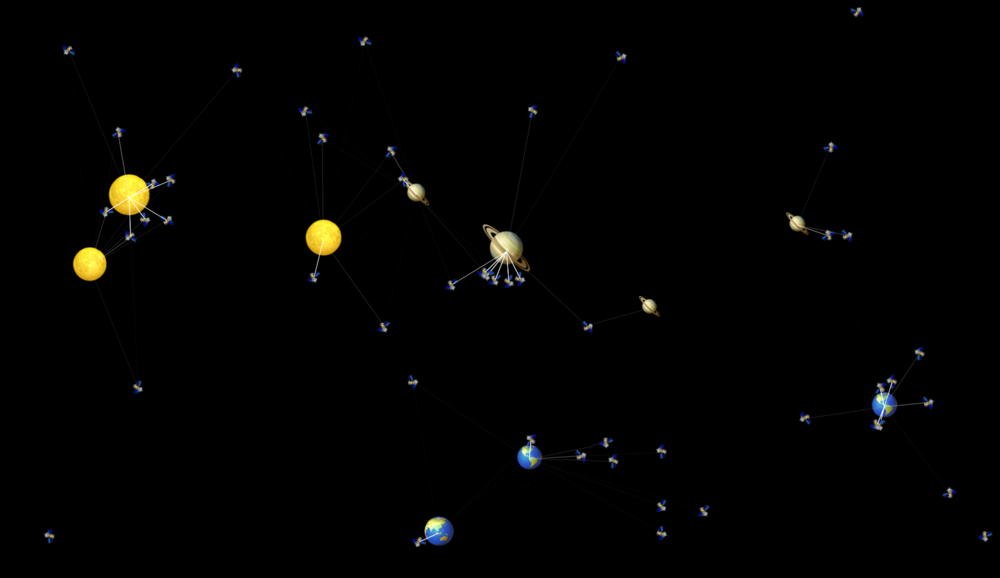

# Choreography

Some fun demos of emoji choreography using spatial indexing.

|  |  |  |
| :--------------------------------: | :--------------------------------------: | :----------------------------------: |

## Current status

I’ve had my fun; this has run its course for now.

There’s a lot of duplication in the code that could be moved into shared library code. All simulations are, at their core, just different agents with a weighted list of movements like `wander()`, `follow(agentType)`, `stopWithin(agentType, radius)`, etc.

## License

WTFPL
